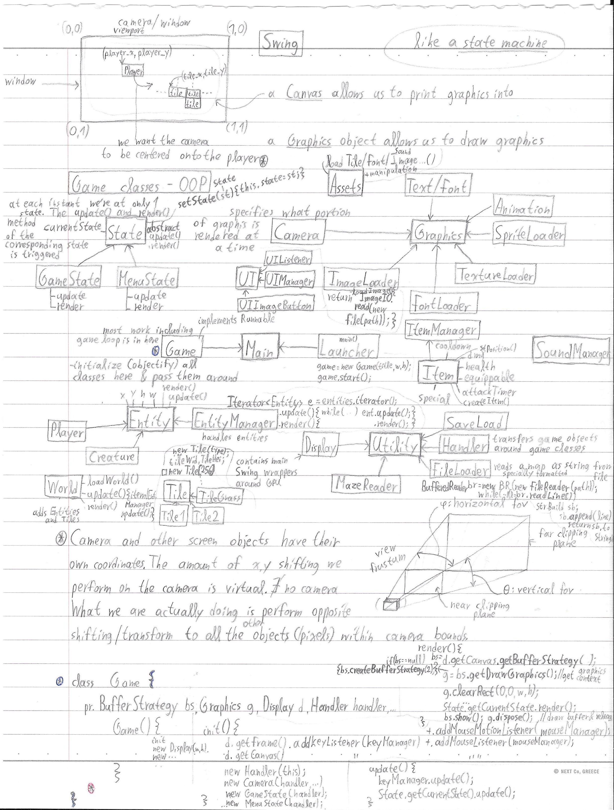
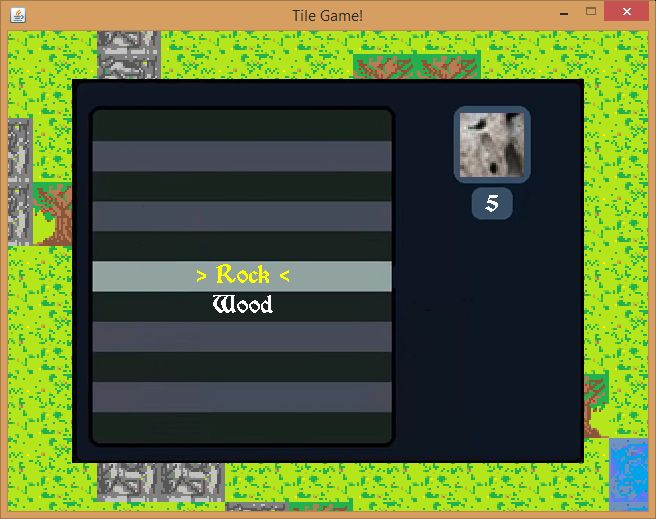

<h1 align="center">
	<a href="https://github.com/KeyC0de/TileGame">Tile Game (Pokemon Wannabe)</a>
</h1>

A minimal but functional tile-based 2d game the likes of the good ol' Pokemon Gen 2. Pokemon Crystal being my favorite video game of all time and the one that introduced me to video games. 

	

This is a minimal but solid implementation. That is only basic two directional movement as well as collision (quad/tile collision) is supported. There is also 2d animation, inventory management, camera scrolling, world bounds clipping, texture loading, input handling and more. I had to stop when I was about to add a skeleton as an enemy and implement a fight system so I never went around to do it but with the current it is pretty easy to do that.

It is pretty low-level; as such proper software engineering concepts are taught such as Singleton, Dependency Injection, State Design Pattern, GameLoop, Double Buffer Strategy, Runnable instance etc. It may serve as a basis for more complex projects, as it lays down fundamental concepts. I hope you can agree with me. `:smile:`

Used:

- Java 8 (no other libraries)
- the now mostly deprecated AWT (Abstract Window Toolkit).
(Better use Swing now and Java 9+.)
- IntelliJ IDEA
- Windows 8.1 x86_64

## Controls

- W : move player up
- S : move player down
- D : move player right
- A : move player left
- I : toggle inventory
- LMB : attack (not finalized)
- RMB : attack (combat not completed)

## Architecture Overview

TADAA!

AAAAAHHHH Chaos right? 

Don't worry, we'll break it all down, piece by piece.

* `Launcher` class : Launches the Game singleton Instance. Optionally with window width & height as inputs.
* `Game` class : The primary class. Runs off as a single thread (`implements Runnable`). Encapsulates all game configuration and major functions.
	- `start()` : creates the single thread for the game to run
	- `stop()` : waits for the thread to be `join()`ed
	- `run()` : runs the game loop which calls `update()` and `render()` frame after frame (loop iteration) and sets up the frame timer to count the time that has elapsed since the previous iteration of the loop. This time is used for `update`ing the game.
	- `init()` : initializes variables to default values
	- `update()` : updates the current `State` class
	- `render()` : gets bufferStrategy from the buffer canvas (basically the "Render Target" for a window for DirectX connoisseurs) to draw into, gets the Graphics Context from it (which is basically our paintbrush we use to draw stuff) it clears the entire buffer and calls the current state's `render()` method to draw everything. Finally it displays the buffer and calls off drawing till next frame.
	- getters and setters
* `Handler` : dependency injection class. Created by the `Game`. It gets passed around around major game components through their contructor to initialize their variables.
* `utility` : miscellaneous classes
	- `Display` : Manages painting and objects in the window/screen
	- `FrameTimer` : counts time elapsed per frame
	- `Handler` : encapsulates key Game information needed by various classes for initialization - Dependency Injection class
	- `Utils` : various utility functions. Here the `loadFileAsString()` loads our `World` (eg level map)
* `State` : Implements the `State` design pattern and switches between states. State is basically an abstract class that allows us to conveniently swap different behavior at runtime. This behavior is evaluated by a class that inherits from `State`. Thus we can call `State::udpate` and `State::render` without needing to know what state we're on and given miscellaneous game properties we get the appropriate (for example if we're paused we use the `MenuState()` `update()` and `render()` which is different behavior from the `GateState()`'s functions of the same name). There are 2 states
	- `GameState` : delegates to world.update()
	- `MenuState` : del

Here's how the game looks when on the `MenuState` and the player's current items:

	

* `World` : a game level or map (currently there's only 1 level consisting of 256 tiles). It `loadWorld()`s given file path which is basically a 2d array of ""tiles". It has `update()` and `render()` methods which in return call `update` and `render` on the manager classes.
* `Tile` : the base representation for a tile, with `update` and `render` methods. Lots of classes inherit from it depending on what type of tiles you want to have, eg `GrassTile`, `RoadTile`, `WaterTile`, `TreeTile` etc.
* `Item` : similar to Tile. Additionally there are utilities for creating new items and destroying them.
* `Entity` : similar to `Tile`. However entities are considered the live objects in the world, eg the `Player`, `Creature`s etc. In other words, they are rendered above other `Tile`s (higher priority) and they can move along the world. Entities implement gameplay properties and can interact with other entities or with the world. Entities also have collision boxes (hitboxes) and we `checkEntityCollisions()`. Most of them have health and other common attributes. Health can be decreased via `hurt(int amount)` method. The most important entity is the ``Player`.
	- `Player` : (which inherits from `Entity`). You can see the hitbox bounds in the picture below. Notice that it does not overlap the player as that wouldn't be too realistic. Imagine that a character can duck or huddle to decrease its volume. Thus this smaller hitbox approximates this realism subtlety.
	- `Creature` : miscellaneous creatures or NPCs or enemies or friends or your mother in law.
	

	

* `ItemManager` contains an `ArrayList<Item>` of items to `update` and `render()`. That's all just a collection of `Item`s.
* `EntityManager` similar to `ItemManager` for Entities now. We can also compare entities for various purposes.
* `Camera` : where we are in the world. In reality there is no camera. Depending on where we want to go, say we want to go left, the entire `World` (and everything in it) is moved to the right by the same amount. In other words the `Camera` is a reference point. `centerOnEntity()` is called for the player (typically) and does exactly what it says. It centers the player in the window, UNLESS the player is along the bounds of the map which we determine by calling `checkForMapBounds()`.
* `FontLoader`, `ImageLoader`, `SpriteLoader` (should have named it `SpriteSheetLoader` - a collection of images cramped together in a single picture in a 2d array fashion) all load Fonts, Images, Sprites respectively. They delegate to java.awt library internal routines.
* `Text` : Draws string to the window. Used primarily by the UI.
* `UIObject` : abstract class, basically a tile/quadrilateral of "UI space" with `onMouseMove`. `UIObject`'s need to implement `update()`, `render()`, `onClick()`
* `UIManager` : contains `ArrayList<UIObject>` to iterate over all of them nice and easy
* `KeyManager` : inherits from java.awt.event.KeyListener.
	1. Listens for keyboard events.
	2. Stores all possible keys (boolean array, true = key has been pressed etc.)
	3. Informs the game given a keypress. Does so via overriden methods `keyPressed()`, `keyReleased()`, `keyTyped()`, `keyToggled()`
* `MouseManager` : inherits from java.awt.event.MouseListener|MouseMotionListener. It's job is identical to the `KeyManager` with the sole difference being that is manages mouse inputs.

# Contribute

Please submit any bugs you find through GitHub repository 'Issues' page with details describing how to replicate the problem. If you liked it or you learned something new give it a star, clone it, contribute to it whatever. Enjoy.

# License

Distributed under the GNU GPL V3 License. See "GNU GPL license.txt" for more information.

# Contact

email: *nik.lazkey@gmail.com*  
website: *www.keyc0de.net*

# Acknowledgements

Based on the tutorial by CodeNMore [here](https://www.youtube.com/playlist?list=PLah6faXAgguMnTBs3JnEJY0shAc18XYQZ)! 
I used the free font Morris Roman black by [Dieter Steffmann](http://www.steffmann.de/wordpress/). 
Adobe Photoshop for the graphics and sprites (+ sprite sheets). 
